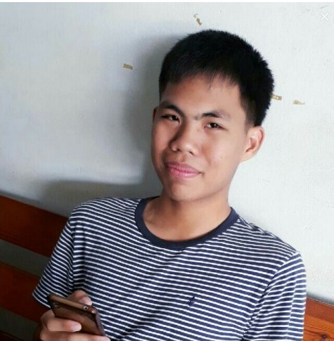
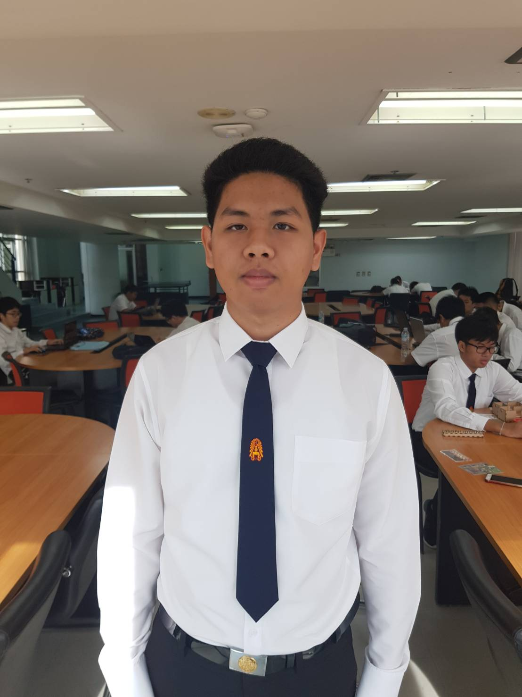

# Project-ComProgramming

# Abstract
  โปรเจคการพัฒนาเกมด้วยโปรแกรม Unity และภาษา C นี้ได้จัดทำขึ้นเพื่อนำความรู้ที่ได้จากการเรียนมาต่อยอดเป็นเกม Puzzle's Adventure ซึ่งเป็นเกมผจญภัย และแก้ปัญหาเพื่อหาทางไปต่อ
  โดยทางผู้พัฒนาได้ใช้โปรแกรม Arduino IDE เพื่อสร้างตัว Controller ขึ้นมาทำให้ผู้เล่นสามารถใช้ Joystickที่ทำขึ้นมา หรือ คีย์บอร์ดเล่นได้ทั้งสองรูปแบบ โดยประโยชน์ที่คาดหวังจากผู้เล่นที่ได้รับจากเกมนี้คือ สมาธิที่เพิ่มขึ้น และมีกระบวนการคิดที่มีประสิทธิภาพมากขึ้น

# [Gameplay](https://www.youtube.com/watch?v=BttLCyATKe0&feature=youtu.be)

# Team Members
|  |ชื่อ|นามสกุล|GitHub Username|รหัสนักศึกษา|
|:-:|--|------|---------------|---------|
||Rachapat|Pheimphun|[@torasannn](https://github.com/torasannn)|60070083|
||Suphasan|Silarot|[@Suphasan](https://github.com/Suphasan)|61070227|
||Soravit|Yamkum|[@SoravitYK](https://github.com/SoravitYK)|61070234|
||Arnon|Unton|[@stupidwolfy](https://github.com/stupidwolfy)|61070268|
